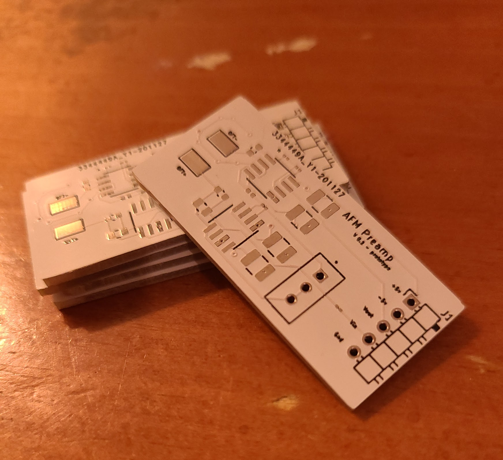
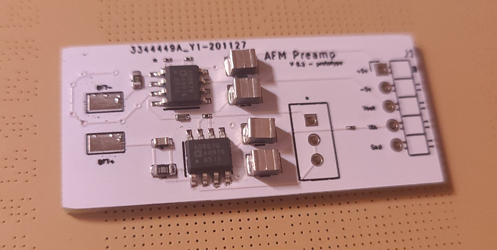

# The Pre-Amplifier Board has Arrived - *December 7th, 2020*

The pre-amplifier board has arrived from jlpcb. This is just an initial prototype (hence the "v0.1 - prototype" label on the board), but it should help me confirm whether my approach for an AFM will work. The components have also arrived, so I'll be putting this together when my semester ends in about two weeks.

When I get a chance, I'll also post about how I intend for the AFM to function (along with some very iffy drawings). It's different from most commerical AFMs, where a laser is used to detect the movement of a cantilever, but instead uses an oscillating, deconstructed quartz tuning fork (QTF) to detect surface detail.

This project is partially inspired by Dan Berard's fantastic Frequency-Modulated Atomic Force Microscope project on Hackaday. His ideas and schematics for the pre-amplifier were extremely useful in helping me design this.

# Back to the Schematic... Board - *December 11th, 2020*

I found some time to heat up my reflow station and solder one of the boards. In the process of doing so, I realized I made a couple of mistakes that I should've caught before hand.

I picked giant capacitors for some reason. This isn't bad, just annoying.
I forgot to order the trimmer potentiometer. I have to be careful about this.
I used two of the same op-amp when I meant to use two different models that have different characteristics. Oops!
I'll re-design and re-order it as soon as possible. I'm hoping that I won't have to go through more than a few iterations of this before getting it working.
