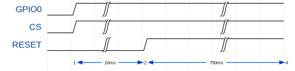

# Intro to the Airlift

The [Adafruit Airlift](https://www.adafruit.com/product/4201) is a WiFi coprocessor based on the ESP32 available for about US$10.

It's little more than an ESP32 on a breakout board with some extra hardware to let you share the SPI bus with multiple devices. Interestingly, it's running a custom firmware that's
a fork of the NINA W102 firmware from u-blox. As a result, instead of using [AT commands](https://en.wikipedia.org/wiki/Hayes_command_set) (an extremely cursed plaintext protocol often used to
communicate with modems) the Airlift talks over custom binary protocol on SPI at up to 8 MHz.

The protocol isn't _explicitly_ documented anywhere, but there are at least two separate implementations of a driver for the Airlift so it was possible to reverse engineer.

- [Adafruit CircuitPython ESP32SPI](https://github.com/ladyada/Adafruit_CircuitPython_ESP32SPI)
- [WiFiNINA (Arduino's flavor of C++)](https://github.com/arduino-libraries/WiFiNINA)

The WiFiNINA library was pretty difficult to follow and I didn't have much luck with reverse engineering it, but the CircuitPython ESP32SPI library is much better architected. I didn't have too much trouble figuring out once I found that library.

# Communicating with the Airlift

As I mentioned above, the Airlift expects a custom binary protocol over an SPI bus at 8 MHz or less.

## The WifiNINA/Airlift Protocol

As well as the basic pins one would expect with SPI (e.g. SCK, MISO, MOSI, and CS), communicating with the Airlift requires connecting to the BUSY and GPIO0 pins as well.

Before sending packets to the Airlift, the controller must initiate a reset of the Airlift. This is done with the GPIO0, CS, and RESET pins:

<br>

<br>

```rust
pub fn reset(&mut self) -> Result<(), E> {
    self.gpio0.set_high().ok();
    self.cs.set_high().ok();
    self.reset.set_low().ok();

    // delay 10ms, reset
    self.timer.delay_ms(10);

    self.reset.set_high().ok();

    // delay 750ms, wait for it to boot up
    self.timer.delay_ms(750);

    Ok(())
}
```

The protocol is packet-based and all commands are acknowledged. Before sending a packet, the driver should wait until the BUSY pin is low.

Constants used in commands:

| Name       | Value  |
|------------|--------|
| START_CMD  | 0xE0   |
| REPLY_FLAG | 1 << 7 |
| END_CMD    | 0xEE   |
| ERR_CMD    | 0xEF   |

The CMDs allowed:

| Name       | Value  |
|------------|--------|
| SetNet | 0x10 |
| SetPassPhrase | 0x11 |
| SetKey | 0x12 |
| SetIPConfig | 0x14 |
| SetDNSConfig | 0x15 |
| SetHostname | 0x16 |
| SetPowerMode | 0x17 |
| SetAPNet | 0x18 |
| SetAPPassPhrase | 0x19 |
| SetDebug | 0x1a |
| GetTemperature | 0x1b |
| GetConnStatus | 0x20 |
| GetIPAddress | 0x21 |
| GetMACAddress | 0x22 |
| GetCurrentSSID | 0x23 |
| GetCurrentBSSID | 0x24 |
| GetCurrentRSSI | 0x25 |
| GetCurrentEncryption | 0x26 |
| ScanNetwork | 0x27 |
| StartServerTCP | 0x28 |
| GetStateTCP | 0x29 |
| DataSentTCP | 0x2a |
| AvailableDataTCP | 0x2b |
| GetDataTCP | 0x2c |
| StartClientTCP | 0x2d |
| StopClientTCP | 0x2e |
| GetClientStateTCP | 0x2f |
| Disconnect | 0x30 |
| GetIndexRSSI | 0x32 |
| GetIndexEncryption | 0x33 |
| RequestHostByName | 0x34 |
| GetHostByName | 0x35 |
| StartScanNetworks | 0x36 |
| GetFirmwareVersion | 0x37 |
| SendUDPData | 0x39 |
| GetRemoteData | 0x3a |
| GetTime | 0x3b |
| GetIndexBSSID | 0x3c |
| GetIndexChannel | 0x3d |
| Ping | 0x3e |
| GetSocket | 0x3f |
| SetClientCert | 0x40 |
| SetCertKey | 0x41 |
| SendDataTCP | 0x44 |
| GetDataBufTCP | 0x45 |
| InsertDataBuf | 0x46 |
| WPA2EnterpriseSetIdentity | 0x4a |
| WPA2EnterpriseSetUsername | 0x4b |
| WPA2EnterpriseSetPassword | 0x4c |
| WPA2EnterpriseSetCACert | 0x4d |
| WPA2EnterpriseSetCertKey | 0x4e |
| WPA2EnterpriseEnable | 0x4f |
| SetPinMode | 0x50 |
| SetDigitalWrite | 0x51 |
| SetAnalogWrite | 0x52 |
| SetDigitalRead | 0x53 |
| SetAnalogRead | 0x54 |

### Sending

The command header:

| Bits | 0 ..= 7   | 8 ..= 13                  | 16 ..= 23            |
|------|-----------|---------------------------|----------------------|
| 24   | START_CMD | The command \| REPLY_FLAG | Number of parameters |
|      |           |                           |                      |

Each command uses parameter lengths that are either 8 bits or 16 bits long.

Each parameter starts with the length in bytes, which is followed by the parameter data. The parameters are concatenated together. Each command is followed by the command footer:

| Bits | 0 ..= 7 |
|------|---------|
| 8    | END_CMD |

### Receiving

The controller should wait for the BUSY pin to go low before reading from the SPI bus.

The header received in the response is exactly the same as the header that was originally sent. The response can contain multiple items, each one starting with either 8 or 16 bits of the length (depending on the command), followed by the data associated with the response. The response will end with the command footer.

## Abstractions

It ended up being possible to write a function that could send and receive essentially any data without allocation through the use of
const generics:

```rust
fn send_cmd<const PARAMS: usize>(
    &mut self,
    cmd: Cmd,
    params: [&[u8]; PARAMS],
    config: SendConfig,
) -> Result<(), Error<E>> { ... }

fn receive_cmd<'a, const RESPONSES: usize>(
    &mut self,
    cmd: Cmd,
    responses: [&'a mut [u8]; RESPONSES],
    config: ReceiveConfig,
) -> Result<heapless::Vec<&'a [u8], RESPONSES>, Error<E>> { ... }

fn send_cmd_and_receive<'a, const PARAMS: usize, const RESPONSES: usize>(
    &mut self,
    cmd: Cmd,
    params: [&[u8]; PARAMS],
    responses: [&'a mut [u8]; RESPONSES],
    config: SendReceiveConfig,
) -> Result<heapless::Vec<&'a [u8], RESPONSES>, Error<E>> {
    self.send_cmd(cmd, params, config.send)?;
    self.receive_cmd(cmd, responses, config.receive)
}
```

# Some of the commands

## Get Firmware Version (GetFirmwareVersion)

|   | Parameters |   | Responses               |
|---|------------|---|-------------------------|
|   |            | 0 | Firmware version string |

In the library, the function that sends this command is written like this:

```rust
/// Retrieve the firmware version. Just guessing at the maximum length here.
pub fn get_firmware_version(&mut self) -> Result<heapless::String<10>, Error<E>> {
    let mut b = [0; 10];

    let resp = self.driver.send_cmd_and_receive(
        Cmd::GetFirmwareVersion,
        [],
        [&mut b],
        SendReceiveConfig::default(),
    )?;

    match str::from_utf8(resp[0]) {
        Ok(s) => Ok(s.into()),
        Err(_) => Err(Error::InvalidEncoding),
    }
}
```

## Get MAC Address (GetMACAddress)

|   | Parameters |   | Responses     |
|---|------------|---|---------------|
| 0 | 0xFF       | 0 | MAC (6 bytes) |

```rust
pub fn get_mac_address(&mut self) -> Result<[u8; 6], Error<E>> {
    let mut b = [0; 6];

    self.driver.send_cmd_and_receive(
        Cmd::GetMACAddress,
        [&[0xff]], // dummy data
        [&mut b],
        SendReceiveConfig::default(),
    )?;

    Ok(b)
}
```

## Scan for Networks (StartScanNetworks)

This command can return any number of responses.

|   | Parameters |     | Responses |
|---|------------|-----|-----------|
|   |            | 0   | SSID 0    |
|   |            | ... | ...       |
|   |            | N   | SSID N    |

## Connect to an access point

### With a password (SetPassPhrase)

|   | Parameters |     | Responses |
|---|------------|-----|-----------|
| 0 | SSID       | 0   |  0x1 if success |
| 1 | password   |     |           |

### Without a password (SetNet)

|   | Parameters |     | Responses |
|---|------------|-----|-----------|
| 0 | SSID       | 0   |  0x1 if success |

There are a bunch more commands, if you'd like to see all of them, take a look at the implementation of the driver I've written: https://github.com/lachlansneff/airlift-driver.